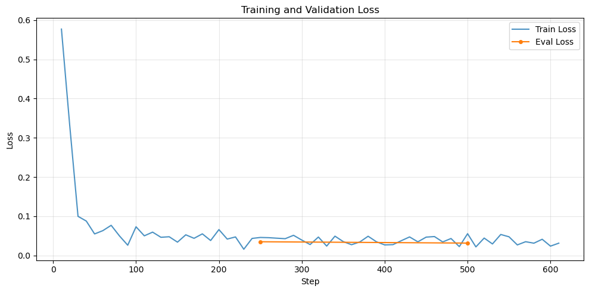

# Step-Level Math Solution Verifier: LLM Fine-Tuning on PRM800K

[](https://colab.research.google.com/github/AsserGharib1/MathReasoningPrm800kFinetune/blob/main/prm800k_math_reasoning_finetune.ipynb)
[](https://nbviewer.org/github/AsserGharib1/MathReasoningPrm800kFinetune/blob/main/prm800k_math_reasoning_finetune.ipynb)

Fine-tuning a compact causal LLM into a **process reward model**: given a mathematical solution, it labels every reasoning step as correct (+), neutral (0), or incorrect (−), the process-supervision paradigm behind modern reasoning pipelines (Lightman et al., *Let's Verify Step by Step*, 2023).

## Results (validation, 50 solutions / 338 steps)

| Metric | Score |
|---|---|
| **Step-level accuracy** | **94.67%** (320/338) |
| Correct-step (+) accuracy | 99.65% (281/282) |
| Incorrect-step (−) accuracy / error-detection recall | **97.50%** (39/40) |
| Neutral (0) accuracy | 0% (0/16), known failure mode, discussed below |
| Trainable parameters (LoRA) | **2.18M** |

The verifier almost never misses an actual error (97.5% error recall) while approving valid steps at 99.7%, achieved with only 2.18M trainable parameters. Note the validation slice is small (50 solutions), so treat these numbers as indicative rather than benchmark-grade. The rare neutral class collapsed into the dominant classes, a classic imbalance effect analyzed in the notebook.

## Training curves



## Method

- PRM800K phase-1/2 JSONL parsing → per-step rating tokens mapped to +/0/−.
- Parameter-efficient fine-tuning with **LoRA** (`peft`) + `trl` on Hugging Face `transformers`, format-constrained generation ("Step N: +/0/−"), token-level evaluation with per-class breakdowns and format-compliance checking.

## Running

```bash
pip install -r requirements.txt
```
The notebook clones PRM800K and runs on a single Colab GPU.
